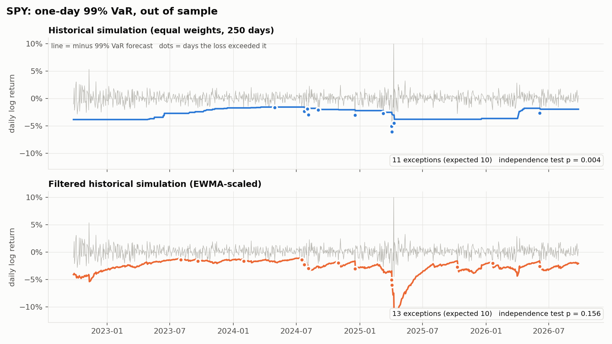
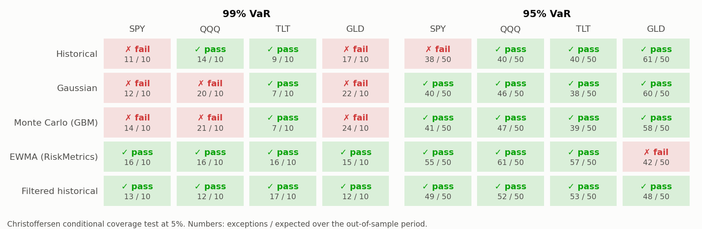

# When does a Value-at-Risk model fail? An out-of-sample backtest

[](https://github.com/TomDemir/var-backtest/actions/workflows/backtest.yml)

Five one-day VaR and Expected Shortfall models, forecast one day at a time on
five years of daily data for four ETFs across three asset classes (US equities:
SPY, QQQ; long Treasuries: TLT; gold: GLD), then
judged by the tests a risk desk or a regulator would apply: Kupiec coverage,
Christoffersen independence, the Basel traffic light, and the McNeil-Frey ES
test.

Every number in the Results tables is written by `scripts/run_backtest.py` in
a GitHub Actions run, not typed by hand; the Findings below are checked
against `results/summary.json`.



## Findings

1. **Getting the frequency right is not enough.** On SPY the historical model
   has 11 exceptions for 10 expected, a near-perfect rate, yet the
   Christoffersen test rejects it (p = 0.004): its exceptions arrive in
   bursts, when volatility jumps faster than a 250-day window can follow
   (August 2024, April 2025 on the chart above).
2. **At 99%, only the conditional models survive across assets.**
   EWMA and filtered historical simulation pass conditional coverage on all
   four ETFs. Historical passes on 2 of 4, Gaussian and Monte Carlo on 1 of 4.
3. **EWMA fixes timing but not the tail.** At 99% it has 15 or 16
   exceptions on every ETF (10 expected), lands in the Basel yellow zone on
   all four, and the McNeil-Frey test finds its Expected Shortfall too low on
   all four (p from 0.004 to 0.047, the last one on TLT and borderline).
   Normal tails are too thin once volatility is filtered out.
4. **Filtered historical simulation is the best of the five, not a perfect
   model.** It passes conditional coverage on all four assets at both 99% and
   95%, and McNeil-Frey does not reject its ES at 95% on any of the four. At 99% it still fails
   Kupiec on TLT (17 exceptions, p = 0.045, Basel yellow), its ES is rejected
   on QQQ and GLD (p = 0.032 and 0.044), and at 95% on GLD its exceptions fail
   the independence test (p = 0.029) even though conditional coverage passes.
5. **Better calibration did not cost more capital, except on gold.** Filtered
   historical has a lower mean 99% VaR than plain historical on SPY, QQQ and
   TLT; on GLD it is 58 bps higher.
6. **Monte Carlo adds noise, not information.** It tracks the Gaussian model
   everywhere, and on GLD simulation noise alone moves it from the Basel
   yellow zone (Gaussian, 22 exceptions) to red (24).

## Question

A 99% VaR promises that losses exceed it on 1% of days, **and** that those
days arrive at random. The first promise is about the tail of the
distribution; the second is about how fast the model reacts to a change in
volatility. The textbook estimators address only the first. Do they keep the
second, and does a conditional-volatility model fix what they miss?

## Models

| Family | Model | Tomorrow's loss distribution |
|---|---|---|
| Unconditional | **Historical** | empirical distribution of the last 250 returns |
| | **Gaussian** | N(mean, variance) of the last 250 returns |
| | **Monte Carlo (GBM)** | 10,000 simulated one-day GBM returns, same mean and variance |
| Conditional | **EWMA (RiskMetrics)** | N(0, EWMA variance), lambda = 0.94 |
| | **Filtered historical** | last 250 returns divided by their own EWMA volatility, rescaled by tomorrow's (230 on the first 20 test days: EWMA burn-in) |

The EWMA decay lambda = 0.94 is the RiskMetrics (1996) value, fixed before any
test was run and never tuned on the test period. The Monte Carlo model is
included because the original version of this project used it; with Gaussian
shocks over one day it is the Gaussian model plus simulation noise, and the
results show exactly that.

## Tests

| Test | Question | Null rejected when |
|---|---|---|
| Kupiec (1995) POF | Is the exception rate right? | p < 0.05 |
| Christoffersen (1998) | Are exceptions independent from one day to the next? | p < 0.05 |
| Conditional coverage | Both at once (chi2, 2 df) | p < 0.05 |
| Basel traffic light | Would a regulator accept the model? (binomial bands, generalised from 250 to 1,004 days) | yellow or red |
| McNeil-Frey (2000) | When VaR is breached, is the loss the size ES predicted? | p < 0.05 (one-sided: ES too low) |

Also reported: the **ES ratio** (mean realised loss on exception days divided
by the mean predicted ES) and the **mean VaR** (in log-return units, like all
VaR and ES figures here), which is what the model costs in capital. A model can pass every test by being very conservative; mean VaR
exposes that.

## Results

<!-- RESULTS:START -->
**SPY**, returns 2021-09-28 to 2026-09-25, 1004 out-of-sample days from 2022-09-26 (file sha256 `c44357ec9ac8`). Window 250 days, EWMA lambda 0.94, seed 42, 10,000 Monte Carlo draws per day.

**99% VaR**

| Estimator | Exceptions (obs / exp) | Kupiec p | Christoffersen p | Cond. cov. p | Basel zone | ES ratio | McNeil-Frey p | Mean VaR |
|---|---|---|---|---|---|---|---|---|
| Historical | 11 / 10.0 | 0.764 | 0.004 | 0.016 | green | 1.24 | 0.010 | 2.73% |
| Gaussian | 12 / 10.0 | 0.546 | 0.006 | 0.020 | green | 1.45 | 0.003 | 2.40% |
| Monte Carlo (GBM) | 14 / 10.0 | 0.236 | 0.013 | 0.022 | green | 1.36 | 0.006 | 2.39% |
| EWMA (RiskMetrics) | 16 / 10.0 | 0.082 | 0.252 | 0.114 | yellow | 1.28 | 0.004 | 2.16% |
| Filtered historical | 13 / 10.0 | 0.369 | 0.156 | 0.245 | green | 1.04 | 0.109 | 2.65% |

**95% VaR**

| Estimator | Exceptions (obs / exp) | Kupiec p | Christoffersen p | Cond. cov. p | ES ratio | McNeil-Frey p | Mean VaR |
|---|---|---|---|---|---|---|---|
| Historical | 38 / 50.2 | 0.065 | 0.014 | 0.009 | 1.09 | 0.088 | 1.69% |
| Gaussian | 40 / 50.2 | 0.126 | 0.091 | 0.074 | 1.23 | 0.005 | 1.68% |
| Monte Carlo (GBM) | 41 / 50.2 | 0.169 | 0.107 | 0.106 | 1.23 | 0.005 | 1.68% |
| EWMA (RiskMetrics) | 55 / 50.2 | 0.493 | 0.566 | 0.671 | 1.13 | 0.008 | 1.53% |
| Filtered historical | 49 / 50.2 | 0.862 | 0.691 | 0.910 | 0.99 | 0.414 | 1.67% |

In-sample, for reference only: excess kurtosis 7.9, skewness 0.15; the 99% historical quantile is 51 bps beyond the Gaussian one.

**Robustness, 99% VaR on four ETFs (US equities, Treasuries, gold)** (exceptions / expected · conditional coverage at 5%)

| Estimator | SPY | QQQ | TLT | GLD | Passes (of 4) |
|---|---|---|---|---|---|
| Historical | 11/10 · **fail** | 14/10 · pass | 9/10 · pass | 17/10 · **fail** | 2 |
| Gaussian | 12/10 · **fail** | 20/10 · **fail** | 7/10 · pass | 22/10 · **fail** | 1 |
| Monte Carlo (GBM) | 14/10 · **fail** | 21/10 · **fail** | 7/10 · pass | 24/10 · **fail** | 1 |
| EWMA (RiskMetrics) | 16/10 · pass | 16/10 · pass | 16/10 · pass | 15/10 · pass | 4 |
| Filtered historical | 13/10 · pass | 12/10 · pass | 17/10 · pass | 12/10 · pass | 4 |

**Same, 95% VaR**

| Estimator | SPY | QQQ | TLT | GLD | Passes (of 4) |
|---|---|---|---|---|---|
| Historical | 38/50 · **fail** | 40/50 · pass | 40/50 · pass | 61/50 · pass | 3 |
| Gaussian | 40/50 · pass | 46/50 · pass | 38/50 · pass | 60/50 · pass | 4 |
| Monte Carlo (GBM) | 41/50 · pass | 47/50 · pass | 39/50 · pass | 58/50 · pass | 4 |
| EWMA (RiskMetrics) | 55/50 · pass | 61/50 · pass | 57/50 · pass | 42/50 · **fail** | 3 |
| Filtered historical | 49/50 · pass | 52/50 · pass | 53/50 · pass | 48/50 · pass | 4 |
<!-- RESULTS:END -->



## Design choices that matter

* **No look-ahead, tested.** The forecast for day t uses returns up to t-1
  only. A unit test overwrites day t and every later day and checks that all
  fifteen day-t outputs (VaR, ES, scale for five models) are unchanged.
* **Causal volatility.** The EWMA variance for day t is built from returns
  strictly before t; the filtered model standardises each past return with the
  volatility forecast that existed on that day.
* **Reproducible randomness.** One `SeedSequence` child per forecast day, so
  results do not depend on execution order.
* **Stable results on unstable inputs.** Yahoo returns slightly different
  adjusted closes on every download, so the input SHA-256 changes from run to
  run. Across four CI runs (commits `efc5a3c`, `be7d0b7`, `4736e49`,
  `4d69c50`) every exception count was identical and every statistic agreed
  to within 2e-4.
* **One source of truth.** The tables above are injected into this README by
  the same run that produces `results/summary.json`, which also stores the
  SHA-256 of every input file.

## Limitations

* **Low power at 99%.** About 1,000 test days give 10 expected exceptions.
  A p-value above 0.05 means "not rejected", not "correct".
* **Many tests.** Five models, four assets, two levels, several tests: some
  rejections are expected by chance alone at the 5% level. The conclusions
  rely on patterns that repeat across assets, not on single p-values.
* **One period.** 2021 to 2026 contains a rate-hiking cycle and several sharp
  equity drawdowns; a different five years could rank the models differently.
* **Single positions, one-day horizon.** No portfolio aggregation, no
  multi-day scaling, no transaction costs.
* **Data.** Yahoo Finance adjusted closes via `yfinance`, not an institutional
  feed; adjusted prices can be revised retroactively.

## Reproduce

```bash
python -m venv .venv && source .venv/bin/activate
pip install -r requirements.txt && pip install --no-deps -e .
python scripts/download_data.py      # data/*.csv, not committed
python scripts/run_backtest.py       # results/ and the tables above
python -m unittest discover tests    # 21 tests
```

Prices are downloaded locally rather than committed: `yfinance` states that
the Yahoo Finance API is intended for personal use, so raw data is not
redistributed here. Only derived statistics are published.

## Layout

```
src/varbt/estimators.py   the five VaR / ES models
src/varbt/backtest.py     rolling forecasts and the four tests
src/varbt/plots.py        figures
scripts/                  download and run
tests/test_varbt.py       21 unit tests, including no-look-ahead and a GARCH sanity check
```

## References

* Kupiec, P. (1995). Techniques for verifying the accuracy of risk measurement models. *Journal of Derivatives*.
* Christoffersen, P. (1998). Evaluating interval forecasts. *International Economic Review*.
* J.P. Morgan / Reuters (1996). *RiskMetrics Technical Document*.
* Barone-Adesi, G., Giannopoulos, K., Vosper, L. (1999). VaR without correlations for portfolios of derivative securities. *Journal of Futures Markets*.
* McNeil, A., Frey, R. (2000). Estimation of tail-related risk measures for heteroscedastic financial time series. *Journal of Empirical Finance*.
* Basel Committee on Banking Supervision (1996). Supervisory framework for the use of backtesting in conjunction with the internal models approach.
